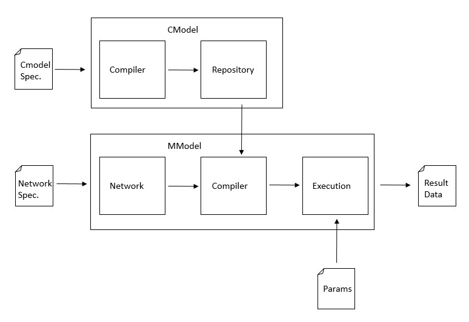

# Manual Técnico

## Objetivos de la aplicación

La aplicación desarrollada y las siguientes versiones de la misma deben de satisfacer los siguientes requerimientos:

- Utilizar diferentes tipos de modelos compartimentales en los nodos de la red
- Utilizar diferentes modelos de movimientos para la población de la red
- Graficar la evolución de la epidemia en un nodo seleccionado de la red
- Graficar la evolución de la epidemia en la red

## Requerimientos de la aplicación

La aplicación fue desarrollada en `python 3.9` y las principales dependencias son los siguientes módulos:

- `dash`
- `numpy`
- `pandas`
- `scipy`
- `ply`
- `matplotlib`

 Para una lista completa de todos los módulos necesarios referirse al documento `requirements.txt`

La aplicación puede ser ejecutada en cualquier computadora que cumpla estos requerimientos o en un contenedor de `Docker` para el cual se provee el archivo para su construcción.

## Arquitectura de la aplicación

La aplicación sigue una arquitectura de 2 capas, la capa de interfaz de usuario y la capa de simulación.

A pesar de que la aplicación está implementada utilizando un servidor (debido al uso de `dash`) la aplicación no soporta una arquitectura cliente servidor. La principal consideración tomada para esta decisión fue la necesidad de implementar la entrada de usuario mediante la lectura de archivos, esto se debe a la gran cantidad de condiciones iniciales que puede tener un meta modelo haciendo impracticable ingresar los datos dentro de la misma aplicación. Esto genera como consecuencia la necesidad de cargar varios archivos a la aplicación para poder ser usada, incluido volver a cargar un archivo al producirse cualquier cambio. Al utilizarse una arquitectura cliente servidor esto implicaría el envío constante de archivos a través de la red, lo cual puede provocar grandes demoras al probar un modelo con distintos parámetros. 

### Simulación

La capa de simulación se compone de los módulos `CModel` y `MModel`



**Entrada de datos**

La entrada de datos se realiza mediante la lectura de archivos debido a la gran cantidad de datos a ingresar cuando el tamaño de los modelos a simular crece, para esto se debieron tomar consideraciones especiales dado que la aplicación es ejecutada por un navegador este no tiene acceso al sistema de ficheros del sistema, por lo cual la ruta de los archivos de entrada debe ser especificada como datos de entrada.

Existen tres tipos de archivos de entrada: el archivo de especificación de modelo compartimental, el arhivo de especificación de la red y el arhivo de parámetros de la simulación. Estos archivos vienen en formatos extensibles como JSON Graph Format y Graph ML.

-----

#### CModel

El módulo CModel se divide en dos submódulos: un compilador para transformar código LaTex en código python para poder ejecutar los modelos compartimentales y un repositorio para almacenar los modelos compartimentales generados y que sean accesibles para ser utilizados en los metamodelos.

**Compilación**

Este módulo localizado en `cmodel/cmp` contiene una versión reducida de un compilador de LaTex, pudiendo parsear aquellas expresiones necesarias para los modelos epidémicos utilizados. El compilador sigue un diseño modular, el lexer y el parser se implementaron utilizando el módulo de metacompilación `ply`, para encontrar una especificación detallada de la gramática referirse al archivo `cmodel/cmp/parser.out`. Para la generación del código se utilizó un patrón visitor sobre las clases del árbol de sintaxis abstracta.

Debido a su diseño el compilador es extensible, ya sea añadiendo nuevos tokens al lexer `cmp/lexer.py`, producciones a la gramática `cmp/parser.py`, clases al árbol de sintaxis abstracta `cmp/ast.py`  y modificando el recorrido del generador de código sobre el árbol `cmp/codegen.py`.

La salida del compilador genera clases las cuales contienen un método `solve` el cual puede ser utilizado para simular el modelo compartimental y una colección de generadores de ecuaciones, estos generadores permiten generar el modelo compartimental sustituyendo los valores de los conjuntos y parámetros por sus valores reales, lo cual es necesario para la compilación de los metamodelos.

```python
from scipy.integrate import odeint

class SIS:

    sets = ["S", "I"]
    params = ["beta", "alpha"]
    equations = {
        "S": lambda S, I, beta, alpha: f"-{beta} * {S} * {I} + {alpha} * {I}",
        "I": lambda S, I, beta, alpha: f"{beta} * {S} * {I} - {alpha} * {I}",
    }

    @staticmethod
    def deriv(y, t, params):
        S, I = y
        beta, alpha = params
        dSdt = -(beta * S * I) + alpha * I
        dIdt = beta * S * I - alpha * I
        return dSdt, dIdt

    @staticmethod
    def solve(y, t, params):
        return odeint(SIS.deriv, y, t, args=(params,))
```

El código mostrado es un ejemplo de la salida del compilador, se puede ver el método `deriv` el cual es el sistema de ecuaciones implementado en python, el método `solve` el cual utiliza la biblioteca de cómputo científico `scipy` para resolver el sistema. El diccionario `equations` asocia cada conjunto con un una función anónima la cual permite generar su ecuación, pudiendo sustituir los valores de los conjuntos y parámetros de manera conveniente podemos utilizarlo para referirnos a la posición de estos valores en un vector de condiciones iniciales o un vector de parámetros pudiendo automatizar así la generación de estos sistemas dentro de las redes.

**Repositorio**

El repositorio del módulo contiene los modelos compartimentales compilados y permite cargarlos dinámicamente dentro de la aplicación para utilizarlos en los metamodelos.

-----

#### MModel

Este módulo se encarga de modelar las redes utilizadas, utilizando los modelos compartimentales en cada nodo para compilar un modelo a mayor escala modificando las ecuaciones para tomar en cuenta el movimiento de individuos entre nodos. 

**Redes**

Este módulo está implementado siguiendo un diseño de POO añadiendo una representación de redes a la aplicación que permita obtener independencia de los formatos de especificación de las redes

Un nodo de la red es definido como `Node(id: int, label: string, model: cmodel)`, las aristas son dirigidas y ponderadas definidas como `Edge(source_node: int, target_node: int, weight: float)`

Una red se define como una estructura la cual tiene un conjunto de nodos y un conjunto de aristas `Network(nodes: Node[], edges: Edge[])`

La clase `Network` es una abstracción para ganar independencia de la especificación de las redes, para no basar la lógica de otros módulos en los formatos de especificación la clase implementa un método `load(file)` el cual detecta la extensión del archivo y llama al método encargado de procesar el formato de dicho archivo, lo cual permite añadir nuevos formatos de manera muy sencilla sin afectar el resto de la aplicación.

```python
class network:
	#... some definitions ...
	
	# this will be the interface for all encoding methods
	def load(file):
		if file.extension == 'json':
			load_json(file)
        elif file.extension == 'xml':
            load_xml(file)
		# ...
		
	# actual encoding methods
	def load_json(file):
		pass

    def load_xml(file):
        pass
```

**Meta modelos**

El archivo `mmodel/mmodel.py` define una interfaz básica la cual debe cumplir todo metamodelo, diferenciádose entre sí en la forma que generan sus ecuaciones. Esto permite añadir nuevos metamodelos de manera sencilla sin tener que cambiar el código de otros módulos.

```python
class MetaModel:
    # ctr...

    # This method is the same for every meta model since is loading the parameters and feed them to the model
    def simulate(self, input_file, t):
        # load the input file
        # load the compiled model file
        # run the compiled model with the input
        pass

    # This method is the same for every meta model since is constructing auxialiar structures and code generation
    def compile(self):
        # generate the code
        # save the code to a file
        pass

    # An abstract method to compute auxiliar structures for the code generation of the model
    def __compute_structures__(self):
        pass

    # An abstract method to generate the code of the model
    def __generate_code__(self):
        pass
    
    # ...
```
Mediante la sobrescritura de los métodos `__compute_structures__` y `__generate_code__` se pueden crear nuevos meta modelos sin afectar el resto de la aplicación

Los archivos `flux.py` y `simple_trip.py` contienen la implementación de dos clases derivadas de `MetaModel`

Al igual que los modelos compartimentales la compilación de estos modelos resulta en un archivo `.py` el cual contiene una clase que contiene un método `solve(t, y, params)`, esta clase es cargada dinámicamente dentro de la aplicación y utilizada para simular el modelo.

La clase `MetaModel` también contiene métodos para generar plantillas de los archivos de entrada de parámetros para facilitar su uso por los usuarios.

```python
def export_input(self, file):
    pass

def import_input(self, file):
    pass
```

Estos arhivos utilizan formatos de fácil comprensión por el usuario como JSON y XML.

### Interfaz de usuario

La interfaz de usuario fue implementada utilizando el módulo `dash`, este módulo permite construir aplicaciones dinámicas de visualización de datos.

El módulo de interfaz de usuario está constituido por los archivos `app.py`, `index.py` y `network_simulation.py`.

**Diseño y extensibilidad**

La interfaz de usuario fue implementada para permitir poder ser ampliada utilizando el diseño multipágina de `dash`, como convención debe ser creado un nuevo archivo `.py` para cada página de la apliación. En la versión actual de la aplicación esta solo cuenta con una página dedicada a mostrar los datos de las simulaciones de los meta modelos implementada en el archivo `network_simulation.py`.

Luego se deben enrutar los requests a las distintas páginas de la aplicación dentro del arhivo `index.py`.

```python
# Import the page layout from the .py file
from network_simulation import layout as network_simulation_page

# pathname parameter stands for the url of the requested web page
def display_page(pathname):
    # There is only the network simulation page for now
    return network_simulation_page
```
Por lo que la interfaz de usuario puede ser extendida de una forma sencilla agregando nuevas páginas y seleccionando la adecuada de acuerdo al valor del parámetro `pathname`

## Limitaciones y recomendaciones

Entre las limitaciones podemos encontrar el uso de modelos que tengan distintos conjuntos, siendo posible utilizar redes con distintos modelos compartimentales en los nodos estos deben cumplir poseer los mismos conjuntos. Esta limitación pudiese abordarse desde el enfoque de que todos los nodos tienen los mismos conjuntos sin embargo plantea grandes retos, por ejemplo si población vacunada pasa de un nodo a otro que no tiene dicho conjunto cómo debería ser el comportamiento del conjunto en este nuevo nodo.

Otra limitación importante es que debido a que los modelos son procesados simbólicamente durante la compilación puede darse el caso donde conjuntos con símbolos distintos tienen un mismo significado semántico sin embargo la aplicación no tiene forma de reconocer esto por lo que es necesario un uso consciente de la notación por parte del usuario.

Algunas adiciones interesantes podrían ser nuevos modelos de redes o meta modelos como redes con varios niveles o extender el modelo Simple Trip para un viaje de $k$ nodos.

